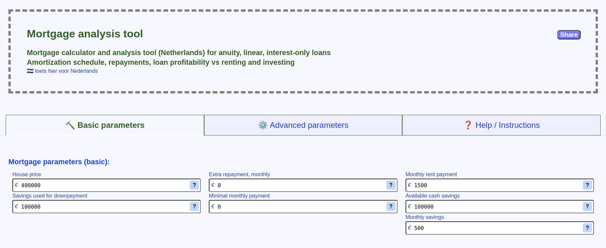
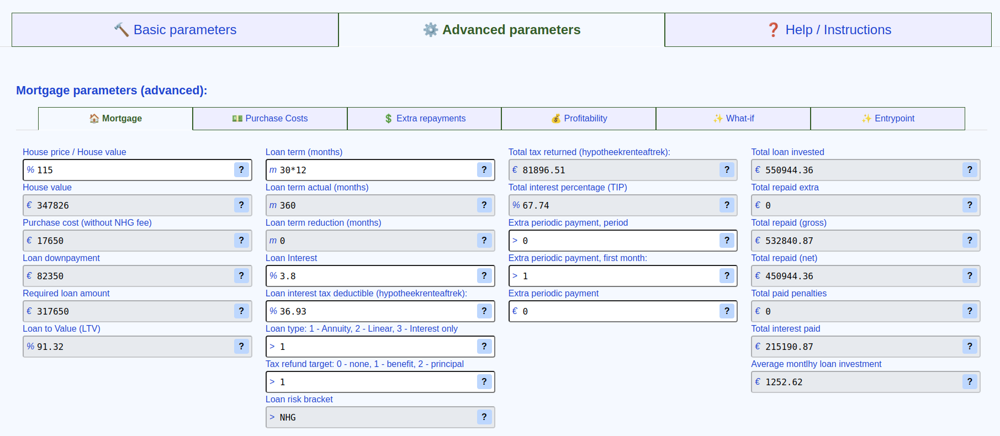
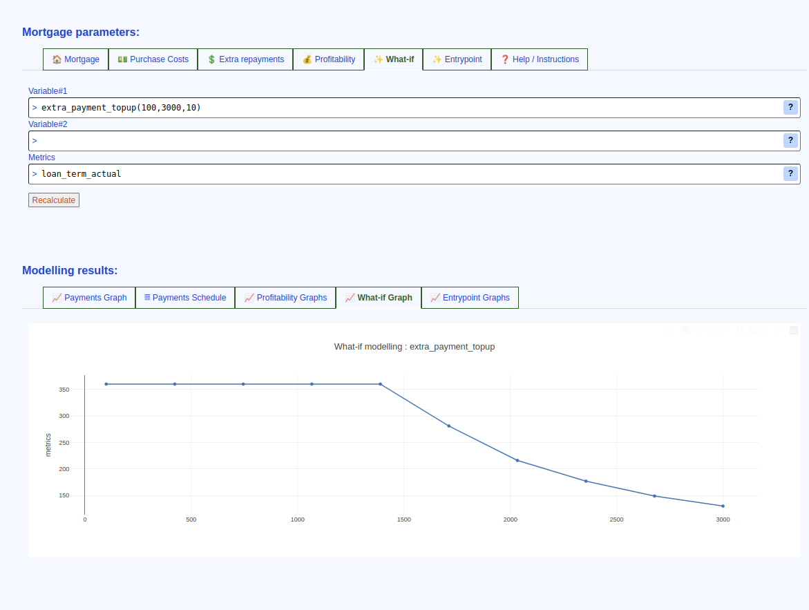
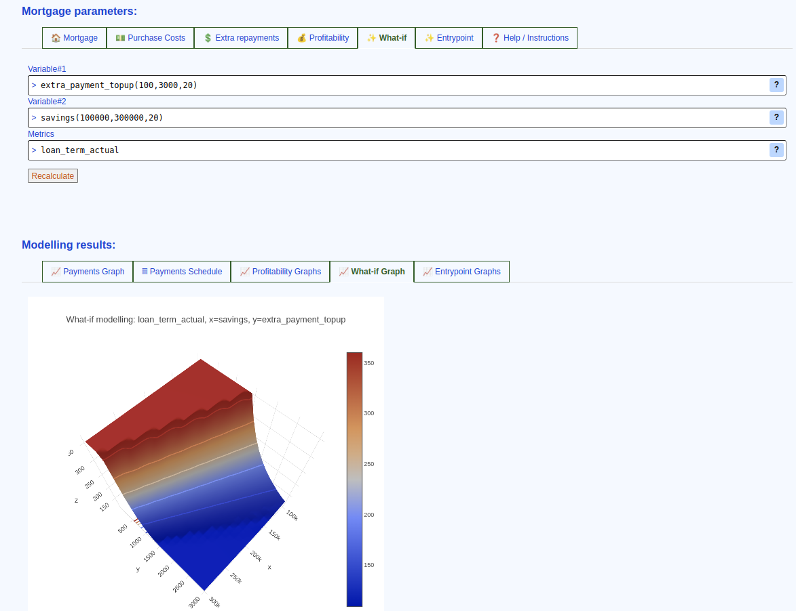
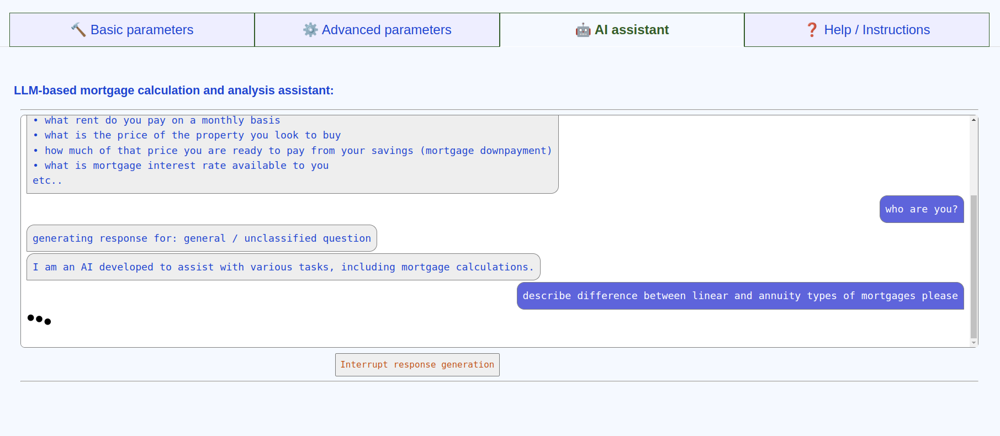

# Mortgage calculator tool for Netherlands

---
# features:

* Minimalistic design:
    - virtually no dependencies.
    - no need to install anything for local testing / development.
* Superflexible, yet to get started you only need to provide a handful of figures.
* Supports 3 most popular mortgage types in Netherlands: "Annuity", "Linear" and "Interest-only".
* Adjustable additional periodic extra repayment schedules, monthly, flexible periodic repayments:
    - ability to "program" a monthly additional repayment.
    - 3 additional periodic repayments with any periodicity and starting month.
* Adjustable in-place extra repayments (click on any cell in "extra_payment" column in the "Payments schedule"):
    - for already calculated payment schedule you can "change" any extra repayment in-place and the schedule will be recalculated from that month onward.
* Renting, income parameters for assets ROI modelling:
    - takes into account deposit rate, house market growth rate, salary and renting information to calculate monthly total assets state and final "ROI" figures.
* What-if modellig provides uni- and bi-parameter mortgage modelling functionality:
    - to test different loan parameters and to find the most convenient/profitable mortgage configuration.
* Entrypoint modelling:
    - comparison of financial outcomes for "buy now" vs "buy X months later" scenarios.
* LLM assistant:
    - a small language model integrated with calculator. Works directly in the browser and can set mortgage calculation parameters, interpret calculation results and answer general mortgage-related questions.
* Mortgage / financial context fine-tuning:
    - approximately 30 parameters available to describe the financial context.

---
# "What-if" modelling:

Allows to model the mortgage as a function of a parameter(s).
* Any adjustable mortgage parameter can be "probed" on a range of values (e.g. extra monthly repayment).
    - you'll see the parameter variable name when you hover mouse over the input field for it
* Resulting output parameters of the mortgage then plotted on the graph (e.g. actual mortgage term).

Allows bi-parametric mortgage modelling.
* With two parameters being "tested" - target metric drawn on a 3-D surface plot (e.g. actual mortgage term as a function of both extra monthly repayment and initial downpayment).

---
# AI assistant:

---
# hosted on github pages:

 * English: [Mortgage calculator tool (Netherlands)](https://hypotheek-bereken.com/)
 * Dutch: [Hypotheek berekenen](https://hypotheek-bereken.com/nl/rekenmachine.html)

---
# Local development / testing:

1. clone the repo: `git clone https://github.com/r0d1on/mortgage-tool`
2. make changes
3. open `./en/mortgage-calculator.html` in your browser

---
# How to contribute:

All contributions you make are **highly appreciated**.

## Add changes, open a pull request

1. [Fork the Project](https://docs.github.com/articles/fork-a-repo) 
2. Create your Feature Branch (`git checkout -b feature/new-amazing-parameter`)
3. Commit your Changes (`git commit -m 'added new loan parameter'`)
4. Push to the Branch (`git push origin feature/new-amazing-parameter`)
5. [Open a Pull Request](https://docs.github.com/articles/using-pull-requests)

---
# credits:

 * uses https://github.com/plotly/plotly.js for visualisation
 * inspired by https://github.com/santiago-pan/mortgage-calculator
 * COOP/COEP workaround for Github pages: https://github.com/gzuidhof/coi-serviceworker
 * wllama - Wasm binding for llama.cpp: https://github.com/ngxson/wllama
 * Phi-3-mini LLM model: https://huggingface.co/microsoft/Phi-3-mini-128k-instruct ([MIT  license](https://huggingface.co/microsoft/Phi-3-mini-128k-instruct/resolve/main/LICENSE))

---
# support:

 * [buymeacoffee.com/r0d1on](https://buymeacoffee.com/r0d1on)
 * [patreon.com/r0d1on](https://patreon.com/r0d1on)

