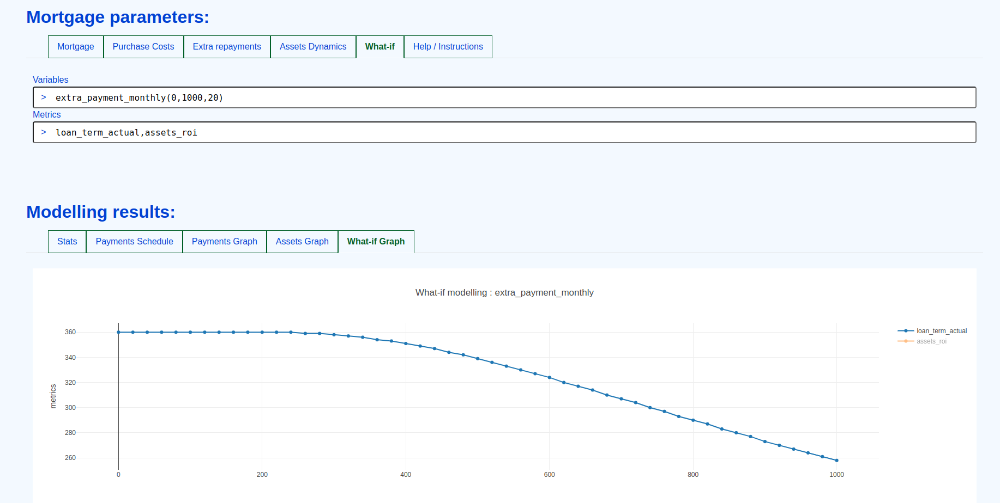

# Mortgage calculator tool for Neherlands

---
# features:

* Simple :)
* Annuity / Linear / Interest-only mortgage types
* Adjustable additional repayment schedules, monthly, flexible periodic repayments
* Renting / income parameters for assets ROI modelling
* "What-if" modelling: flexible mortgage modelling as a function of a parameter.
* * any adjustable mortgage parameter can be "probed" on a range of values (extra monthly repayment).
* * resulting output parameters of the mortgage then plotted on the graph (actual mortgage term).

---
# hosted on github pages:

 * https://r0d1on.github.io/mortgage-tool/

---
# credits:

 * uses https://github.com/plotly/plotly.js for visualisation
 * inspired by https://github.com/santiago-pan/mortgage-calculator
