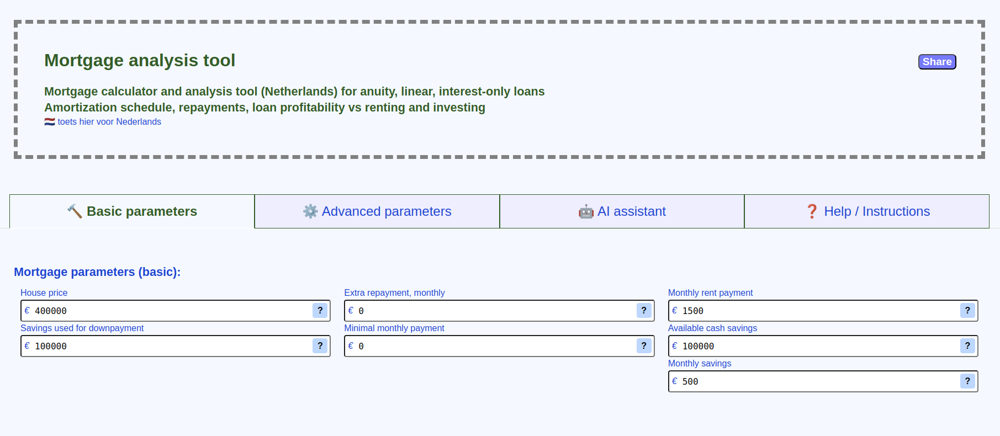

# Mortgage calculator tool for Netherlands

---
# features:

* Superflexible, yet to get started you only need to provide a handful of figures:
    - House sell price
    - Savings used for downpayment
    - Loan Interest
    - Loan type
* Annuity / Linear / Interest-only mortgage types
* Adjustable additional periodic repayment schedules, monthly, flexible periodic repayments
* Adjustable in-place payments (click on any cell in "extra_payment" column in the "Payments schedule")
* Renting, income parameters for assets ROI modelling
* what-if modellig provides uni- and bi-parameter mortgage modelling functionality

---
# "What-if" modelling:

Allowes for mortgage modelling as a function of a parameter(s).
* any adjustable mortgage parameter can be "probed" on a range of values (e.g. extra monthly repayment).
    - you'll see the parameter variable name when you hover mouse over the input field for it
* resulting output parameters of the mortgage then plotted on the graph (e.g. actual mortgage term).

Allowes bi-parametric modelling.
* with two parameters being "tested" - target metric drawn on a 3-D surface plot (e.g. Housing assets ROI).

---
# hosted on github pages:

 * [Mortgage expense calculator, English](https://r0d1on.github.io/mortgage-tool/)
 * [Hypotheekbetalingscalculator, Nederlands](https://r0d1on.github.io/mortgage-tool/index-nl.html)

---
# Local development / testing:

1. Clone the repo: `git clone https://github.com/r0d1on/mortgage-tool`
2. make changes
3. open `index.html` in your browser

---
# How to contribute:

All contributions you make are **highly appreciated**.

## Add changes, open a pull request

1. [Fork the Project](https://docs.github.com/articles/fork-a-repo) 
2. Create your Feature Branch (`git checkout -b feature/new-amazing-parameter`)
3. Commit your Changes (`git commit -m 'added new loan parameter'`)
4. Push to the Branch (`git push origin feature/new-amazing-parameter`)
5. [Open a Pull Request](https://docs.github.com/articles/using-pull-requests)

---
# credits:

 * uses https://github.com/plotly/plotly.js for visualisation
 * inspired by https://github.com/santiago-pan/mortgage-calculator

---
# support:

 * [buymeacoffee.com/r0d1on](https://buymeacoffee.com/r0d1on)
 * [patreon.com/r0d1on](https://patreon.com/r0d1on)

